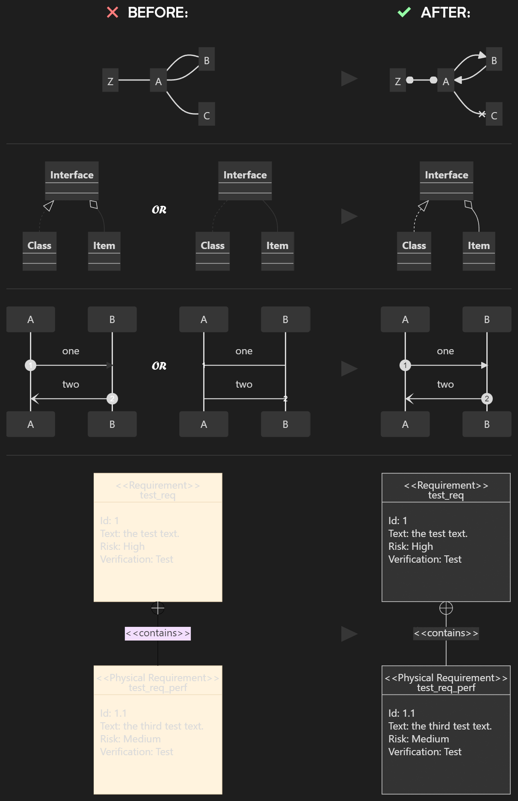

# Mermaid Fixer

## Plugin presentation

Obsidian supports [Mermaid diagrams](https://mermaid.js.org/intro/), but their implementation suffers from two issues:
- Arrows are sometimes not rendered (e.g., when going from *Edit* to *Read* view),
- Some of the styling doesn't properly adapt to Obsidian colors, sometimes leading to illegible results when using a dark color scheme.

This plugin is a hack that takes care of both these issues.

## How it works

All the magic is contained in the plugin button in the ribbon. It is used to define Mermaid arrows in a safe place.
Thus, the button needs to exist, but clicking it actually does nothing.

(For more details, check the [Developer's Readme](src/README.md).)

## Settings

### Button visibility

Because the plugin button needs to be there, but does nothing from a user standpoint, you can choose to make it (almost) invisible by making it empty, rather than using the Mermaid icon. It will still be there, just not visibile (except when bringing your mouse over it).

To avoid having an empty space in your ribbon, remember you can use the Obsidian settings to ensure that the button is at the end of the ribbon. To do so, find *“Ribbon menu*”, in the *“Appearance”* tab and under the *“Advanced”* section.

### Covered Mermaid diagram types

You can select what types of Mermaid diagrams this plugin takes care of.

Know that there is an incompatibility between the standard arrow head used in user journeys, and the one used in sequence diagrams and C4 context diagrams. That being said, if you use both sequence diagrams and user journeys, the arrow head defined for sequence diagrams will be used in both cases, resulting in something still usable.
