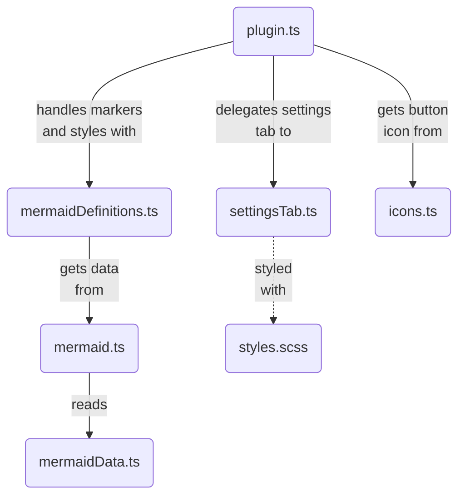

<!-- While in ./src, this document is not compiled. It is a README file for developpers, distinct from the user-oriented README file at the root of the project. -->

# About the “Mermaid Fixer” plugin implementation

## What's the issue with Mermaid in Obsidian?

### Why are arrows disappearing?

For every Mermaid diagram, an SVG is created to render said diagram.

To handle arrows and other line-ending markers, [SVG markers](https://developer.mozilla.org/en-US/docs/Web/SVG/Element/marker) are used. They are defined in the SVG element of each diagram, e.g.:
```svg
<marker id="arrowhead" refX="9" refY="5" … orient="auto">
	<path d="M 0 0 L 10 5 L 0 10 z"></path>
</marker>
```

then used by refering to their ID with `url(…)`:
```svg
<line x1="75" y1="199" x2="275" y2="199" …
	marker-start="url(#sequencenumber)"
	marker-end="url(#arrowhead)"
></line>
```

The issue is: those IDs are not made unique.

When some SVG elements use `url(#arrowhead)`, it is the first element in the DOM with ID `arrowhead` that is used to render the marker.

In many cases, it is not an issue: it points to some identical marker anyway.
But in Obsidian, this marker can often be in a DOM element with `display: none` — in which case *it will not show*.

For example, when you're going from *Edit view* to *Read view*, the *Edit view* is still loaded and present in the DOM, prior to the *Read view*, but with `display: none`. As the result, your diagrams in the *Read view* use the markers defined in the *Read view*, and they are not displayed.

### Why are there issues with dark modes?

The issue here is simpler. Mermaid diagrams are styled through the `<style>` element in each SVG. While most color-related values have been adapted to use Obsidian CSS variable, some went through the cracks and still use fixed predefined colors.

## How the plugin works

### Basic idea

To solve the [arrow issue](#why-are-arrows-disappearing), the trick is to define the markers in a safe place, i.e., somewhere in the DOM elements that:
- Precedes note contents,
- Will not be subjected to `display: none`.

In Obsidian, the ribbon buttons are such a place (and can be used without altering the DOM in a way that could conflict with the rest of the software implementation).

So, we create a plugin button that includes the required marker definitions. And while we're at it, we include some CSS that fixes the [styling issues](#why-are-there-issues-with-dark-modes).

Note that this is definitely a hack! Ideally, Mermaid should ensure the use of unique IDs.

### The files

The files implementing the plugin are in `./src`. They are:
- [`plugin.ts`](plugin.ts): The entry point, defining the Obsidian product. (It defines the class that extends Obsidian's `Plugin` class).
- [`mermaidDefinitions.ts`](mermaidDefinitions.ts): Handles Mermaid's diagram-specific markers and styles.
- [`mermaid.ts`](mermaid.ts): An adapter to provide the necessary Mermaid-related data.
- [`mermaidData.ts`](mermaidData.ts): The raw Mermaid-related data (diagram types, markers and necessary style fixes).
- [`settingsTab.ts`](settingsTab.ts): Handles the plugin settings tab in Obsidian. (It defines the class that extends Obsidian's `PluginSettingTab` class).
- [`styles.scss`](styles.scss): Style for the plugin UI in Obsidian.
- [`icons.ts`](icons.ts): Defines icons used for the plugin UI in Obsidian.



## The plugin needs updating?

### Where to look

If the plugin needs updating due to changes done to Mermaid (e.g., changes in the marker IDs), it is most probably [`mermaidData.ts`](mermaidData.ts) that must be updated.

Use the inspector (<kbd>Ctrl</kbd>+<kbd>Shift</kbd>+<kbd>I</kbd>) on a Mermaid-produced diagram to identify what's wrong (what marker element should be used, or what is the issue with the CSS style).

### Updating `mermaidData.ts`

Don't just mindlessly copy the marker element to `mermaidData.ts`:
- **Be sure that all necessary styling attributes included:** Because the marker will be defined within the plugin button, it will not carry the styling that is inherited from the diagram SVG. 
- **Make the styling attributes flaxible using CSS variables:** You can use CSS variables within the attributes of the SVG elements. Use the inspector or what's already done in `mermaidData.ts` to identify the suited variable name.
- **Avoid conflicts through consistent HTML:** In `mermaidData.ts`, markers that give identically results should be defined using idential HTML strings. The plugin uses string comparison to identify conflicts. Don't let it see conflicts where there are none.

### Check the results

#### Test notes

The folder [`test_notes`](../test_notes/) provides Markdown notes using the different types of Mermaid diagrams, and using the different existing markers in each case.

#### Check that the markers work

When the plugin is not active, an easy way to make the markers disappear in Obsidian is to have only one tab with one opened note, be in or activate the *Edit view*, then go into *Read view*.

Use that to confirm that all required markers stay present when the plugin is active.

#### Check that the markers have the proper format

The plugin-created markers should:
- **Match those created** by Mermaid without the plugin (assuming you are not also fixing their style),
- Work with both **light and dark color themes**.

To check these requirements, you can uncomment a line in the method `createButtonFunction()` defined in [`plugin.ts`](plugin.ts), so that the method `toggleDefIDs()` is called when clicking the plugin button.
You can then use the plugin button to toggle the effects of the plugin.

Please, do not forget to comment this line again when done.
