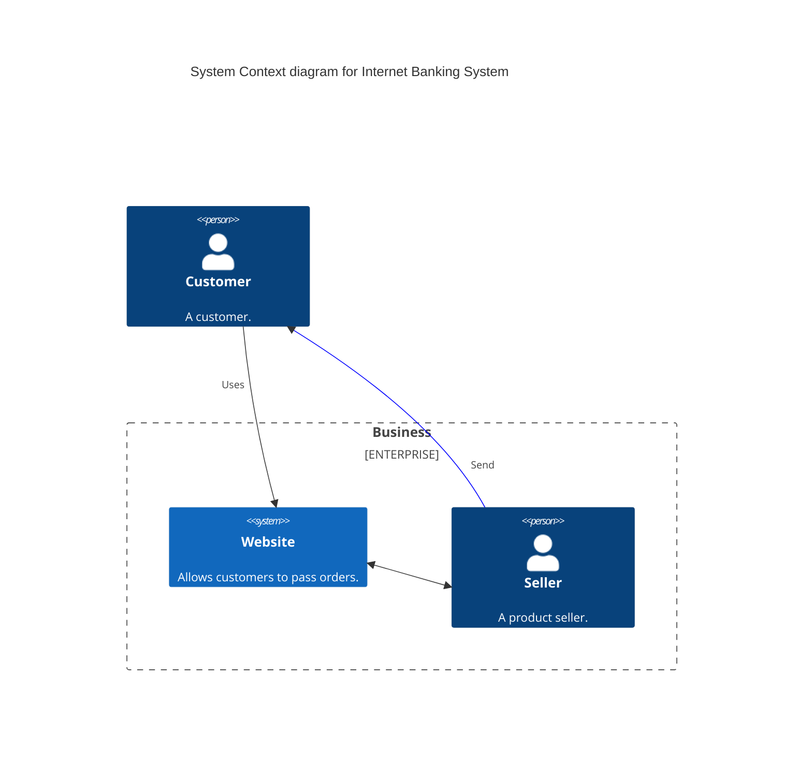

[🧜‍♀️ Syntax](https://mermaid.js.org/syntax/c4c.html)

```mermaid
C4Context
	title System Context diagram for Internet Banking System
	Person(customer, "Customer", "A customer.")
	Enterprise_Boundary(b0, "Business") {
		System(website, "Website", "Allows customers to pass orders.")
		Person(seller, "Seller", "A product seller.")
	}
	
	BiRel(seller, website, "")
	
	Rel(customer, website, "Uses")
	UpdateRelStyle(customer, website, $offsetX="-45", $offsetY="-40")
	
	Rel(seller, customer, "Send")
	UpdateRelStyle(seller, customer, $lineColor="blue", $offsetX="100", $offsetY="55")
```

