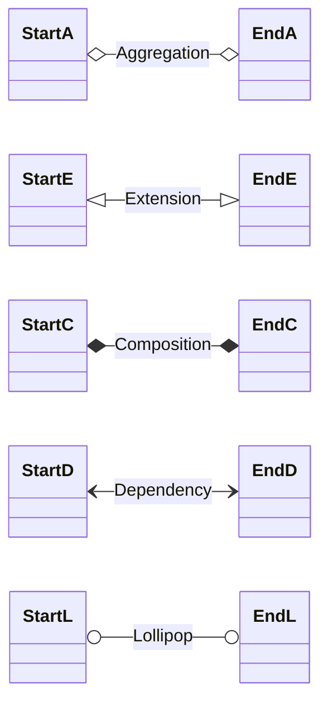

[🧜‍♀️ Syntax](https://mermaid.js.org/syntax/classDiagram.html)

**Note :** As of 2023-06-13, the lollipop end marker is not defined by Mermaid. But an edge linking `classDiagram-lollipopEnd` can be compiled, and Mermaid's [source code](https://github.com/mermaid-js/mermaid/blob/develop/packages/mermaid/src/diagrams/class/styles.js) defines a style for this marker. It is added in the plugin to correct what seems to be an oversight in Mermaid's code.
