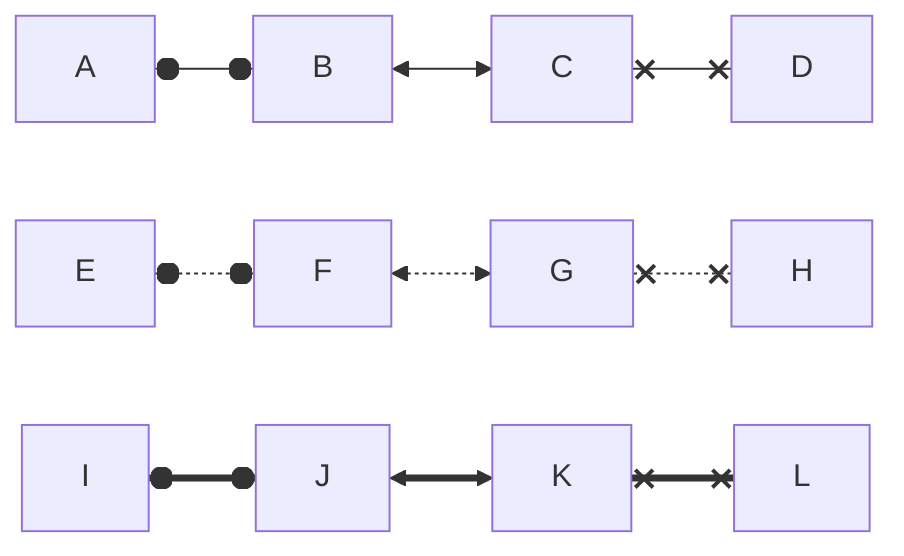
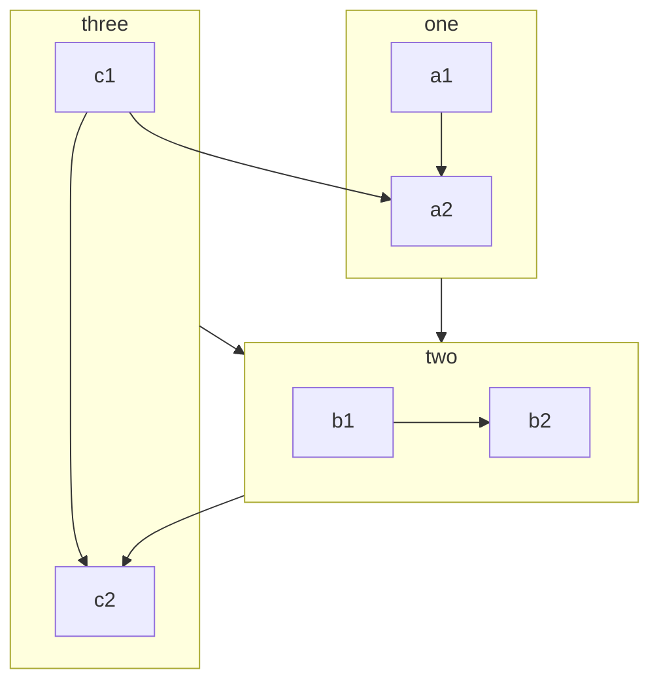

[🧜‍♀️ Syntax](https://mermaid.js.org/syntax/flowchart.html)

```mermaid
flowchart LR
    A o--o B
    B <--> C
    C x--x D
    E o-.-o F
    F <-.-> G
    G x-.-x H
    I o==o J
    J <==> K
    K x==x L    
```

```mermaid
flowchart TB
    c1-->a2
    subgraph one
    a1-->a2
    end
    subgraph two
    b1-->b2
    end
    subgraph three
    c1-->c2
    end
    one --> two
    three --> two
    two --> c2
```
