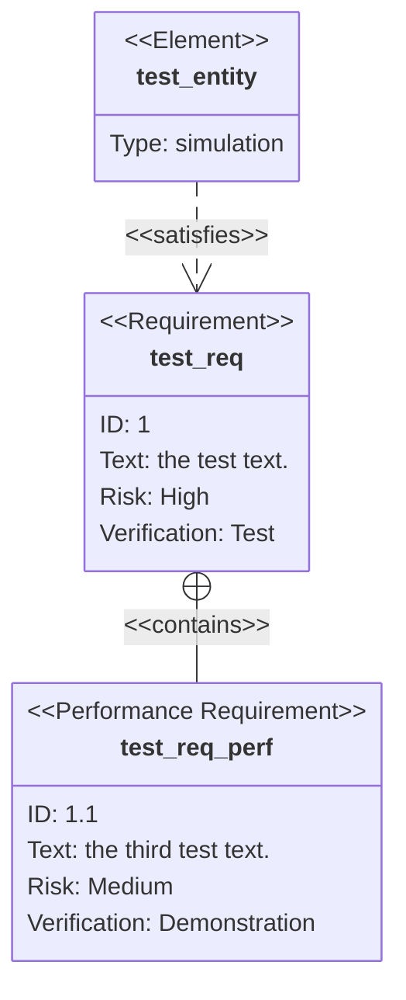

[🧜‍♀️ Syntax](https://mermaid.js.org/syntax/requirementDiagram.html)

```mermaid
requirementDiagram

	element test_entity {
		type: simulation
	}

	requirement test_req {
		id: 1
		text: the test text.
		risk: high
		verifymethod: test
	}

    test_entity - satisfies -> test_req
	
	performanceRequirement test_req_perf {
		id: 1.1
		text: the third test text.
		risk: medium
		verifymethod: demonstration
	}

	test_req - contains -> test_req_perf
```
