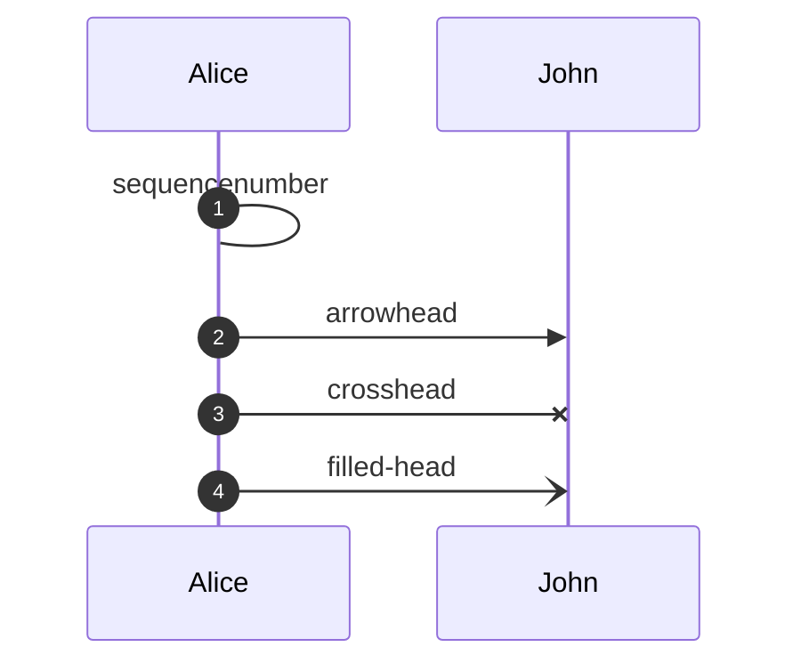
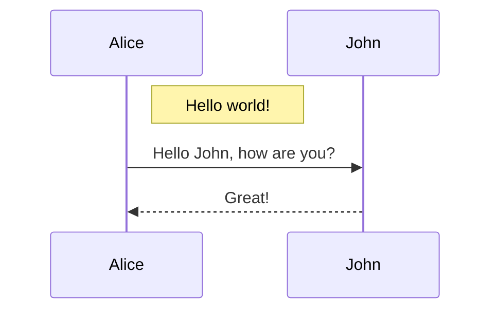

[🧜‍♀️ Syntax](https://mermaid.js.org/syntax/sequenceDiagram.html)

**Note:** As of 2023-13-06, symbols are also defined for ids `computer`, `databased` and `clock`. But, based on the [documentation]([Sequence diagrams | Mermaid](https://mermaid.js.org/syntax/sequenceDiagram.html)) and [source code](https://github.com/mermaid-js/mermaid/blob/develop/packages/mermaid/src/diagrams/sequence/sequenceRenderer.ts), it seems that those ids are actually never used.
