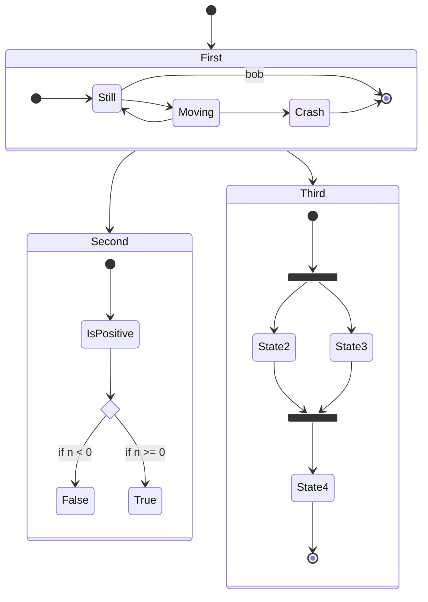

[🧜‍♀️ Syntax](https://mermaid.js.org/syntax/stateDiagram.html)

`stateDiagram`:

```mermaid
stateDiagram
	[*] --> First
	First --> Second
	First --> Third
	
	state First {
		direction LR
		[*] --> Still
		Still --> [*]: bob
		Still --> Moving
		Moving --> Still
		Moving --> Crash
		Crash --> [*]
	}
	
	state Second {
		state if_state <<choice>>
		[*] --> IsPositive
		IsPositive --> if_state
		if_state --> False: if n < 0
		if_state --> True : if n >= 0
	}

	state Third {
		state fork_state <<fork>>
		[*] --> fork_state
		fork_state --> State2
		fork_state --> State3
		state join_state <<join>>
		State2 --> join_state
		State3 --> join_state
		join_state --> State4
		State4 --> [*]
	}
```

`stateDiagram-v2`:

```mermaid
stateDiagram-v2
	[*] --> First
	First --> Second
	First --> Third
	
	state First {
		direction LR
		[*] --> Still
		Still --> [*]: bob
		Still --> Moving
		Moving --> Still
		Moving --> Crash
		Crash --> [*]
	}
	
	state Second {
		state if_state <<choice>>
		[*] --> IsPositive
		IsPositive --> if_state
		if_state --> False: if n < 0
		if_state --> True : if n >= 0
	}

	state Third {
		state fork_state <<fork>>
		[*] --> fork_state
		fork_state --> State2
		fork_state --> State3
		state join_state <<join>>
		State2 --> join_state
		State3 --> join_state
		join_state --> State4
		State4 --> [*]
	}
```
